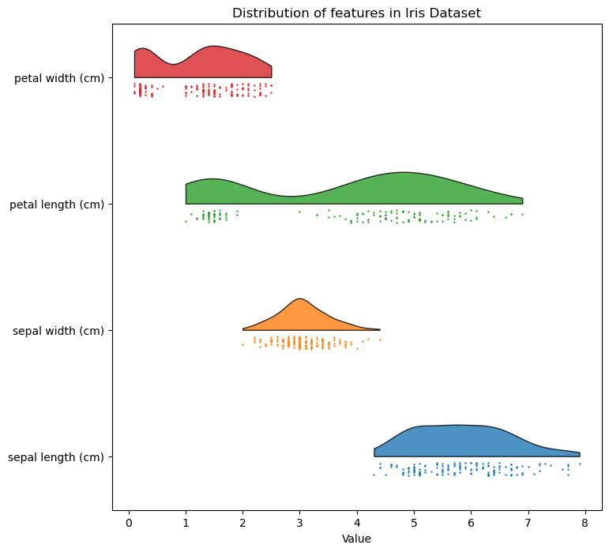

# Raincloud plots

I've tried using violin plots to show data distributions a few times in the past and the general feedback is they're hard to read. I've started using raincloud plots as a replacement which are much better for data visualisation. Most of this code was taken from from [Alex Belengeanu's](#https://medium.com/@alexbelengeanu/getting-started-with-raincloud-plots-in-python-2ea5c2d01c11) blog post with some customisation.

## Example using the SKLearn Iris dataset

